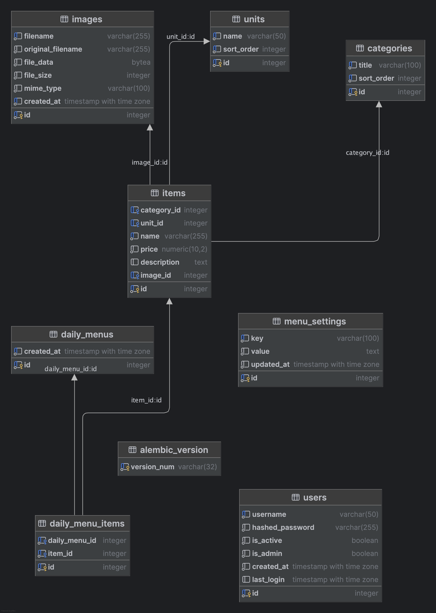

# 📘 Daily Dish Hub Documentation

## 1. 🌍 Overview

Daily Dish Hub is a full-stack application for publishing and maintaining a canteen menu. It combines a FastAPI backend, a React (Vite) admin UI, and an aiogram-based Telegram bot. The system exposes both public endpoints (for menu consumption) and protected admin endpoints that allow staff to curate daily offerings.

> Need visuals? Review planned shots in [SCREENSHOTS.md](SCREENSHOTS.md).

## 2. 🏗️ System Architecture

### 2.1 Components

- **API service (`app/web.py`)**: FastAPI app served by Uvicorn. Provides REST APIs, serves the React admin build, and renders a minimal public menu page via Jinja templates.
- **Telegram bot (`app/bot/__init__.py`)**: aiogram bot that reads menu data through the same service layer as the
  web API. Runs either as a separate Docker service or standalone via `uv run daily_dish_hub`.
- **Database**: PostgreSQL (async SQLAlchemy / asyncpg) stores menu entities, uploads, and users. Alembic manages schema migrations.
- **Rate limit backend**: in-memory by default, Redis when `RATE_LIMIT_BACKEND=redis` (Docker compose includes a Redis service).
- **Frontend (`frontend/`)**: React 18+ with TypeScript. Built assets are copied into `app/static` during CI/Docker builds.

### 2.2 Backend layering

- **API routes (`app/api/`)**: Thin FastAPI routers for authentication, admin CRUD, public data, and image delivery.
- **Services (`app/services/`)**: Business logic and DB access using async SQLAlchemy sessions. Each domain area (items, categories, menu, images, users) has a dedicated service.
- **Schemas (`app/schemas/`)**: Pydantic models for request/response validation with currency helpers and formatting.
- **Middleware (`app/middleware/`)**: Security hardening (header sanitation, method restrictions, CSP) and request rate limiting with optional proxy awareness.
- **Core config (`app/core/config.py`)**: Pydantic settings loader validating secrets, trusted hosts, CSP toggles, and rate limit settings at startup.

## 3. 🧱 Data Model (Abridged)

| Table              | Purpose                                                                      |
|--------------------|------------------------------------------------------------------------------|
| `categories`       | Menu category taxonomy with `sort_order`.                                    |
| `units`            | Measurement units for items.                                                 |
| `items`            | Menu items referencing `categories`, `units`, and optional `images` entries. |
| `images`           | Uploaded media stored as JPEG blobs with metadata.                           |
| `daily_menus`      | Tracks the current menu (one row kept at a time).                            |
| `daily_menu_items` | Join table linking menu entries to items.                                    |
| `users`            | Admin accounts with hashed passwords and roles.                              |
| `menu_settings`    | Key-value storage for menu window settings.                                  |

**Entity diagram:**


## 4. 🔄 Request Flow

1. **Admin UI** authenticates via `/auth/login`, storing a Bearer token in `localStorage`.
2. Authenticated requests hit `/admin/*` endpoints; middleware enforces JWT validation, IP filtering patterns, and rate limits.
3. Service layer performs DB operations; responses are serialized by Pydantic schemas.
4. Public consumers use `/public/*` and `/images/*`. Security middleware applies conservative checks, adds headers (CSP, COOP, CORP, Permissions-Policy), and rate limits anonymously.
5. Telegram bot uses service helpers to pull menu summaries and respond to commands (`/menu`, `/start`, `/help`).

## 5. 🛡️ Security Posture

- **Secrets**: `SECRET_KEY` and database credentials validated at startup; production requires strict trusted hosts.
- **Authentication**: JWT tokens signed with HS256. User passwords hashed with bcrypt. Admin-only endpoints require tokens.
- **Rate limiting**: Distinct buckets for admin, auth, public API, and image access with unified 429 responses.
- **Security middleware**: Blocks suspicious methods, user agents, traversal patterns, and command injections before FastAPI handlers.
- **Docs exposure**: OpenAPI/Swagger disabled by default in production; configurable through `DISABLE_DOCS` and environment `ENV`.

## 6. 🛠️ Local Development Workflow

1. Install prerequisites: Python 3.13+, `uv`, Node.js >= 18, Docker (optional but recommended).
2. Copy `env.example` to `.env`, set `SECRET_KEY` (>=32 chars) and database credentials. Optional `BOT_TOKEN` for bot testing.
3. Run `./scripts/setup.sh` to install Python dependencies (`uv sync`), npm packages, and pre-commit hooks.
4. Start backend locally: `./scripts/run_web.sh` (auto-builds frontend) or run via Docker `./scripts/run_docker.sh up`.
5. Start Telegram bot: `./scripts/run_bot.sh` or rely on the Docker `bot` service.
6. Tests: functional security suite via `tests/run_all.sh`; unit tests can be executed with `pytest` (ensure server is running for HTTP tests).

## 7. 🚢 Deployment Notes

- **Docker**: `Dockerfile` builds React assets, installs Python deps via `uv`, copies migrations, and runs `scripts/init_db.py` before Uvicorn. `docker-compose.yml` wires app, bot, PostgreSQL (port 5433 host), and Redis.
- **Migrations**: `scripts/init_db.py` ensures DB exists, runs Alembic migrations, optionally creates the first admin, and checks schema drift. For manual control use `uv run alembic upgrade head`.
- **Scaling**: switch rate limiter to Redis for multi-instance deployments. Configure proxy headers (`ENABLE_PROXY_HEADERS`, `TRUSTED_PROXIES`, `FORWARDED_ALLOW_IPS`) when behind load balancers.

## 8. 📡 API Surface Summary

### 8.1 Public endpoints

- `GET /` – HTML daily menu (Jinja template).
- `GET /public/daily-menu` – JSON menu for consumers.
- `GET /public/menu-date` – menu window metadata.
- `GET /public/settings` – safe public settings for frontend.
- `GET /images/{id}` – serves stored images with cache headers.
- `GET /health` – healthcheck returning status + version.

### 8.2 Auth & admin endpoints (JWT-protected)

- `POST /auth/login` – authenticate and receive access token.
- `POST /auth/register` – create users (admins only).
- `GET /auth/me` – current user info.
- `GET /auth/users`, `GET/PUT/DELETE /auth/users/{id}` – user management.
- `/admin/items` – CRUD for menu items plus helpers for orphaned/no-unit items.
- `/admin/categories` – CRUD, ordering helpers, bulk move operations.
- `/admin/units` – CRUD and migration helpers.
- `/admin/images` – upload/delete image assets.
- `/admin/daily-menu` – manage current menu, replace/clear items, set menu date window.

### 8.3 Telegram bot commands

- `/start`, `/menu`, `/help` – implemented via aiogram handlers with shared service access.

## 9. ✅ Testing & Quality Gates

- **Functional security suite** (`tests/test_security.py`, `test_admin_protection_smoke.py`, `test_rate_limiter.py`) requires a running server and optional admin credentials.
- **Unit tests** target helpers and image processing (`tests/test_utils_unit.py`, `tests/test_image_service_unit.py`).
- Use `tests/run_all.sh` to execute in a sequence designed to avoid false-positive rate limit hits.
- Pre-commit hooks: `ruff`, `ruff-format`, `detect-secrets`. Configure new hooks in `.pre-commit-config.yaml` if additional checks are required.

## 10. ✍️ Coding Conventions

- **Python**: async SQLAlchemy sessions via `session_scope`; services encapsulate DB logic; Pydantic schemas provide validation and serialization; follow existing type-hinting style.
- **Frontend**: TypeScript with hooks (`useAuth`, `useMenu`, etc.), state lifted to `App.tsx`; API helpers in `frontend/src/services/api.ts` with unified error handling.
- **Configuration**: environment variables first-class; avoid hardcoding secrets or URLs; keep English UI text as default.

## 11. 🗂️ Repository Layout

``` text
app/                # Backend application package
  api/              # FastAPI routers
  bot/              # Telegram bot entry point
  core/             # Configuration and logging
  db/               # Engine initialization, session helpers
  middleware/       # Security and rate limiting middleware
  models/           # SQLAlchemy ORM models
  schemas/          # Pydantic schemas
  services/         # Business logic
  templates/        # Jinja templates for public menu
  static/           # Built frontend assets (generated)
frontend/           # React admin UI (Vite)
migrations/         # Alembic environment and versions
scripts/            # Helper scripts (setup, Docker, migrations, admin creation)
tests/              # Functional + unit tests
```

## 12. 🧭 Next Steps for Contributors

1. Review SECURITY.md before deploying to production.
2. Update `.env` with strong secrets and rate-limit settings suited for your traffic profile.
3. When submitting PRs, include relevant tests and update this document for architecture-impacting changes.
4. If adding APIs, document them here (section 8) and consider adding swagger-friendly docstrings while keeping production docs disabled.
